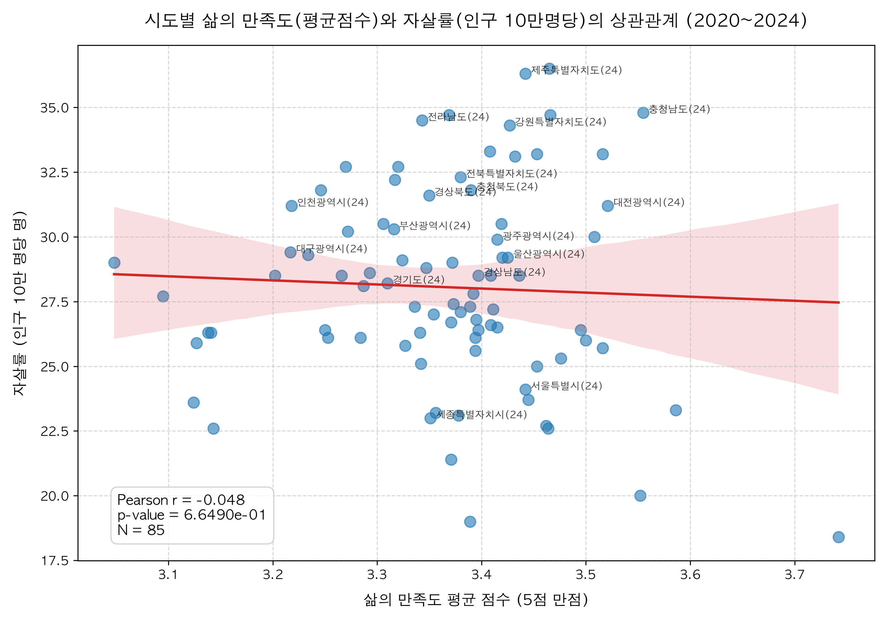
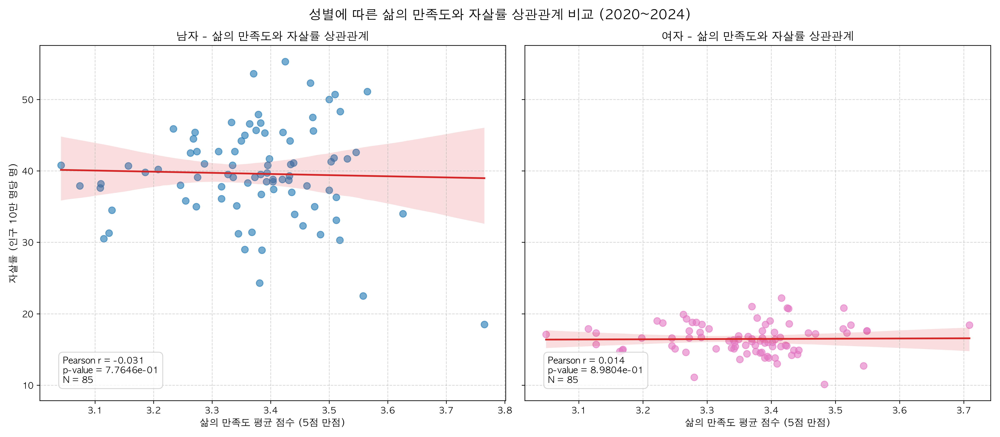

# 대한민국 시도별 삶의 만족도와 자살률 상관관계 분석 보고서

* **작성일자**: 2026년 6월 11일
* **분석 대상 기간**: 2020년 ~ 2024년 (5개년)
* **데이터 출처**: 통계청 및 관계 기관 데이터 (`data/` 폴더 내 엑셀 파일)
  1. 삶의 만족도: `삶의_만족도_시도__20260606195059.xlsx`
  2. 자살률 (인구 10만 명당): `인구십만명당_자살률_시도_시_군_구__20260606194913.xlsx`

---

## 1. 요약 (Executive Summary)

본 분석은 대한민국의 17개 시도별 **삶의 만족도(5점 만점 가중평균)**와 **자살률(인구 10만 명당 자살 사망자 수)** 간의 상관관계를 통계적으로 규명하고자 수행되었습니다. 

* **분석 결과의 핵심 요약**:
  1. **2020년의 뚜렷한 음(-)의 상관관계**: 2020년에는 삶의 만족도가 높은 지역일수록 자살률이 통계적으로 유의미하게 낮았습니다 (상관계수 $r = -0.5135$, $p < 0.05$).
  2. **팬데믹 이후(2021년~) 상관관계 소실**: 2021년 코로나19 대유행의 사회적 여파로 전국의 삶의 만족도가 급감(3.43 $\rightarrow$ 3.21)하면서 지역 간 편차가 왜곡되었고, 이후 삶의 만족도와 자살률 간의 상관관계가 통계적 유의성을 잃었습니다.
  3. **성별 자살률의 격차와 상관성**: 남성 자살률(5개년 평균 약 39.8명)은 여성 자살률(약 16.5명)보다 2.4배 이상 높았습니다. 남성의 경우 2020년에 삶의 만족도와 자살률 간 매우 강한 음의 상관관계($r = -0.5601$, $p < 0.05$)를 보였으나, 여성은 전체 기간 동안 두 지표 간 통계적으로 유의한 상관관계가 발견되지 않았습니다.
  4. **지역적 역설 (Jeju-Chungnam Paradox)**: 충청남도와 제주특별자치도는 높은 삶의 만족도를 기록했음에도 불구하고 자살률 또한 전국 최상위권을 기록하는 역설적인 분포를 보였습니다. 이는 설문 조사 기반의 주관적 만족도 지표가 취약 계층의 실제 사회적 고립이나 높은 자살 위험을 완전히 대변하지 못함을 시사합니다.

---

## 2. 데이터 개요 및 분석 방법론

### 2.1 데이터 소스
* **삶의 만족도 데이터**: 행정구역별(17개 시도), 특성별(전체, 성별) 조사 자료입니다. 매년 삶의 만족도를 5개 척도('매우 만족', '약간 만족', '보통', '약간 불만족', '매우 불만족')의 비율(%)로 제공합니다.
* **자살률 데이터**: 행정구역별(17개 시도), 성별로 인구 10만 명당 자살률(명)을 제공합니다.

### 2.2 변수 정의 및 전처리
1. **행정구역명 통일**: 두 데이터의 지역명 표기법 차이를 통일하였습니다.
   * 자살률 데이터의 `전라북도` $\rightarrow$ `전북특별자치도`로 변환
   * 자살률 데이터의 `제주도` $\rightarrow$ `제주특별자치도`로 변환
2. **삶의 만족도 가중평균 점수화 (Satisfaction_Avg)**:
   주관적 삶의 만족도를 정량적인 하나의 지표로 비교하기 위해 다음과 같이 5점 만점의 가중평균 점수를 산출하였습니다.
   $$\text{삶의 만족도 평균 점수} = \frac{(\text{매우 만족}\% \times 5) + (\text{약간 만족}\% \times 4) + (\text{보통}\% \times 3) + (\text{약간 불만족}\% \times 2) + (\text{매우 불만족}\% \times 1)}{100}$$
3. **분석 대상 세분화**: 
   독립적인 통계 분석을 위해 '전국' 데이터를 제외하고 **17개 시도별 데이터**를 기준으로 분석을 수행했습니다. 또한 '전체(계)', '남자', '여자' 성별에 따라 데이터를 매칭하여 다각도 분석을 진행했습니다.

---

## 3. 상세 분석 결과

### 3.1 연도별 및 성별 상관분석 상세 결과
17개 시도의 데이터를 바탕으로 계산된 피어슨 상관계수($r$) 및 유의확률($p$-value)은 다음과 같습니다. (통계학적으로 $p < 0.05$일 때 유의미한 상관관계가 있다고 판단합니다.)

| 성별 | 연도 | 표본수 (N) | 피어슨 상관계수 ($r$) | 유의확률 ($p$-value) | 통계적 유의성 (5% 수준) | 만족도 평균 (5점 만점) | 자살률 평균 (10만명당) |
| :---: | :---: | :---: | :---: | :---: | :---: | :---: | :---: |
| **계 (전체)** | **2020** | **17** | **-0.5135** | **0.0350** | **유의미한 음의 상관관계** | **3.428** | **26.84** |
| | 2021 | 17 | 0.0498 | 0.8493 | 유의하지 않음 | 3.209 | 27.42 |
| | 2022 | 17 | 0.0771 | 0.7686 | 유의하지 않음 | 3.415 | 26.61 |
| | 2023 | 17 | -0.1087 | 0.6778 | 유의하지 않음 | 3.394 | 28.79 |
| | 2024 | 17 | 0.2296 | 0.3753 | 유의하지 않음 | 3.382 | 30.62 |
| **남자** | **2020** | **17** | **-0.5601** | **0.0194** | **유의미한 음의 상관관계** | **3.453** | **37.06** |
| | 2021 | 17 | 0.1442 | 0.5809 | 유의하지 않음 | 3.200 | 38.51 |
| | 2022 | 17 | 0.2254 | 0.3845 | 유의하지 않음 | 3.423 | 37.98 |
| | 2023 | 17 | -0.1120 | 0.6686 | 유의하지 않음 | 3.400 | 40.35 |
| | 2024 | 17 | 0.2277 | 0.3793 | 유의하지 않음 | 3.391 | 44.14 |
| **여자** | 2020 | 17 | 0.0237 | 0.9280 | 유의하지 않음 | 3.403 | 16.55 |
| | 2021 | 17 | -0.1474 | 0.5724 | 유의하지 않음 | 3.217 | 16.26 |
| | 2022 | 17 | -0.0976 | 0.7095 | 유의하지 않음 | 3.409 | 15.23 |
| | 2023 | 17 | 0.2462 | 0.3409 | 유의하지 않음 | 3.388 | 17.20 |
| | 2024 | 17 | 0.1241 | 0.6352 | 유의하지 않음 | 3.375 | 17.06 |

> [!IMPORTANT]
> **2020년의 특이성**: 2020년 전체 데이터($r = -0.5135, p = 0.0350$) 및 남성 데이터($r = -0.5601, p = 0.0194$)에서 뚜렷한 통계적 음의 상관관계가 나타났습니다. 삶의 만족도가 높은 지역일수록 자살률이 낮았음을 의미합니다.

---

### 3.2 시각화 자료

#### 1) 전체 통합 상관관계 산점도 (2020~2024 통합)
아래 그래프는 5개년 동안 수집된 17개 시도의 모든 관측치(N=85)를 차트에 플로팅하고 선형 회귀선을 나타낸 것입니다. 통합 데이터 기준으로는 상관계수가 **-0.0477**로 나타나 상관관계가 거의 존재하지 않는 평탄한 회귀선을 보입니다.

#### 2) 성별 상관관계 비교 산점도 (남성 vs 여성)
성별에 따른 삶의 만족도와 자살률 분포의 차이를 보여줍니다. 남성의 자살률 분포대(25~55명)가 여성의 분포대(10~25명)보다 훨씬 높게 형성되어 있으며, 남녀 모두 5개년 통합 관측치 기준으로는 뚜렷한 경향성을 찾기 어렵습니다.

---

## 4. 주요 분석 인사이트 및 해석

### 4.1 팬데믹(COVID-19) 시기 삶의 만족도 급락과 사회적 영향
연도별 평균 지표를 추적해 보면 매우 중요한 사회적 패턴이 발견됩니다.
* **2020년 $\rightarrow$ 2021년 변화**: 
  전국 시도 평균 삶의 만족도는 **3.428점에서 3.209점으로 대폭락**했습니다. 이는 코로나19 장기화로 인한 고강도 사회적 거리두기와 경제적 타격이 본격화된 시점과 일치합니다.
  이 시기 평균 자살률은 26.84명에서 27.42명으로 상승했습니다. 
  급격한 외부 충격(팬데믹)으로 인해 모든 지역의 삶의 만족도가 일시적으로 동반 급락하면서, 2020년에 정립되어 있던 지역 간의 통계적 상관관계 구조가 완전히 흐트러지게 되었습니다.

### 4.2 자살률의 장기적 우상향 추세
평균 자살률은 **2022년 26.61명 $\rightarrow$ 2023년 28.79명 $\rightarrow$ 2024년 30.62명**으로 가파른 증가세를 보이고 있습니다. 반면 삶의 만족도는 2022년(3.415점) 이후 2024년(3.382점)까지 큰 회복 없이 정체되거나 소폭 하락하고 있습니다. 이러한 만족도 정체와 자살률 폭증 현상은 최근 심화되는 청년층/고령층의 사회적 고립 및 경제적 취약성 증가와 관련이 있을 것으로 분석됩니다.

### 4.3 지역별 데이터 분석 및 역설적 현상
연도별 상위/하위 3개 지역을 분석한 결과 매우 흥미로운 역설적 특징이 발견되었습니다.

#### **2020년: 상식적 매칭**
* **삶의 만족도 최고**: **세종특별자치시 (3.74점)** $\rightarrow$ **자살률 최저 (18.4명)**
* **삶의 만족도 최저**: **대구광역시 (3.25점)**, **경상북도 (3.29점)**, **충청남도 (3.37점)** $\rightarrow$ **충청남도 자살률 최고 (34.7명)**
> 2020년에는 세종시가 만족도 1위 및 자살률 최저를 기록하고, 충남이 낮은 만족도와 최고 자살률을 기록하는 등 통계적 정비례 관계를 보여줍니다.

#### **2024년: 역설적 현상 (Chungnam & Jeju Paradox)**
* **삶의 만족도 최고**: **충청남도 (3.56점)**, **대전광역시 (3.52점)**
* **자살률 최고**: **제주특별자치도 (36.3명)**, **충청남도 (34.8명)**
> **충청남도**는 2024년 주관적 삶의 만족도 평가에서 전국 1위(3.56점)를 차지했음에도 불구하고, 자살률은 전국 2위(34.8명)를 기록하는 기현상을 보였습니다. **제주특별자치도** 또한 높은 수준의 만족도(3.44점)를 보였으나 자살률은 전국 1위(36.3명)로 가장 높았습니다.

#### **이러한 역설이 발생하는 이유**:
1. **표본 조사의 한계**: 삶의 만족도 조사는 일반 가구 대상의 표본 설문조사로 진행되어 실제 자살 위험군(극심한 우울증 환자, 노인 독거 가구, 경제적 파산 직전 가구 등)의 목소리가 온전히 반영되지 못할 가능성이 있습니다.
2. **인구학적 구성 요인의 격차**: 충청남도나 전라남도 등은 초고령화 지역으로, 독거 노인층의 높은 자살률이 전체 지표를 끌어올리는 반면, 만족도 설문은 상대적으로 경제 활동이 활발한 다수 주민들의 만족도를 포착하여 상충될 수 있습니다.
3. **제주도의 특수성**: 제주는 이주민과 원주민 간의 융합 문제, 도서 지역 특유의 폐쇄성 및 정신건강 인프라 부족 등으로 인해 만족도 지표 이면에 깊은 그늘이 존재함을 보여줍니다.

---

## 5. 결론 및 제언

본 분석 결과는 주관적인 설문 데이터인 **'삶의 만족도'**와 사회적 병리 현상의 종착지인 **'자살률'**을 단순 선형 결합하여 정책적 지표로 삼기에는 한계가 있음을 통계적으로 증명합니다. 

1. **지표의 다각화 필요**: 자살 예방 정책을 수립할 때 단순한 주관적 만족도 설문 결과를 맹신해서는 안 됩니다. 만족도가 높은 지역일지라도 고독사나 취약 계층의 비율이 높을 수 있으므로 실질적 자살 위험 지표를 병행 모니터링해야 합니다.
2. **성별 맞춤형 접근**: 남성의 자살률이 여성보다 2배 이상 높고 2020년에 삶의 만족도와 밀접한 연관성을 보였던 만큼, 중장년 및 청년 남성의 실업, 은퇴 후 고립 등 삶의 만족도를 급락시키는 사회경제적 요인을 집중 타겟팅하는 예방책이 필요합니다.
3. **고위험 지역 집중 관리**: 충남, 제주, 전남 등 자살률이 만성적으로 높은 지역에 대해서는 지역 주민 전체의 만족도 조사 결과와 무관하게, 실제 고위험군인 노인층, 저소득층에 대한 정신건강 관리 인프라를 대폭 확충해야 합니다.
